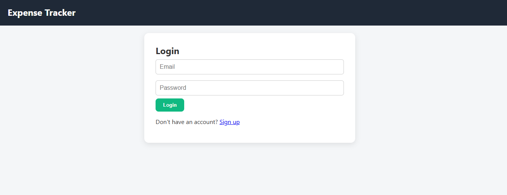
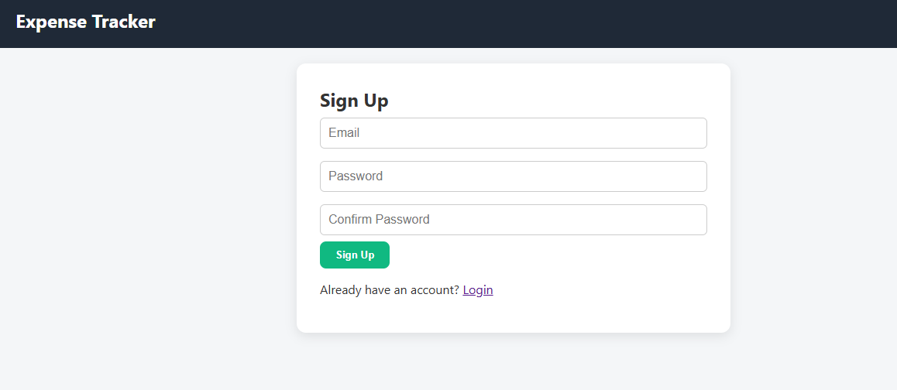
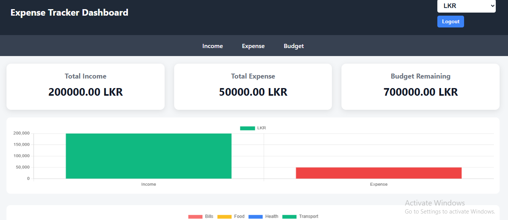
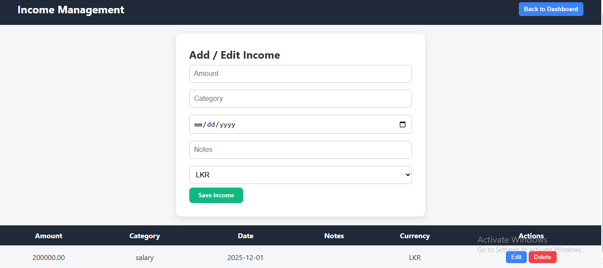
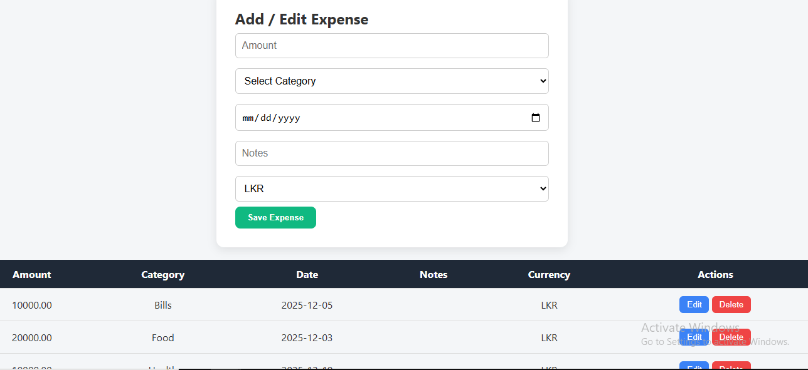
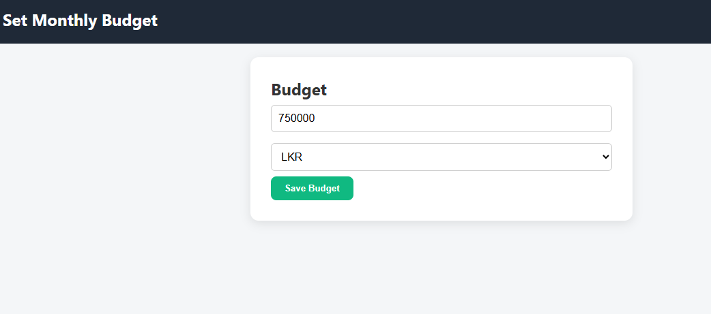
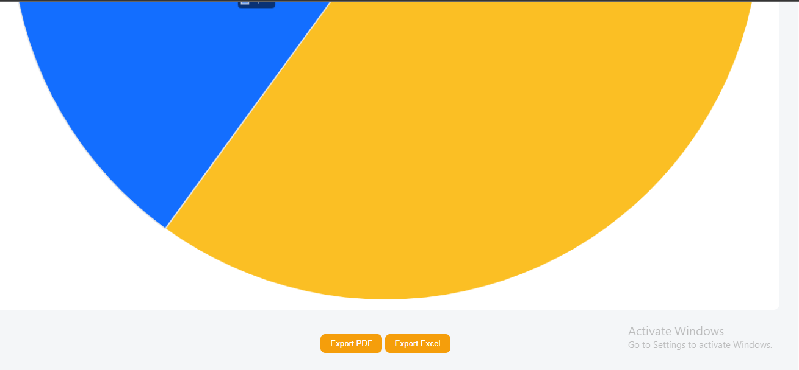
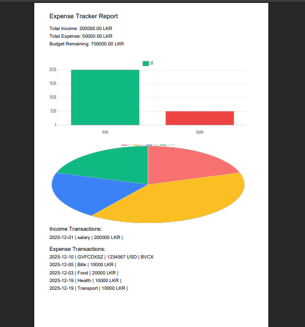

# 💸 Expense Tracker – Firebase Web Application


---

## 🚀 Project Overview

**Expense Tracker** is a full-stack web application built using **HTML, CSS, JavaScript, and Firebase**, designed to help users **track income, expenses, and budgets efficiently** with real-time analytics and export features.

**Purpose:**

* Manage personal finances digitally
* Track income and expenses by category
* Visualize spending with charts
* Export financial reports as PDF and Excel
* Showcase a real-world Firebase-based web application

**Key Highlights:**

* Firebase Authentication (Login & Signup)
* Firestore real-time database
* Multi-currency support (USD, LKR, GBP)
* Interactive charts (Bar & Pie)
* PDF & Excel export functionality
* Fully hosted on Firebase Hosting

---

## 🌟 Portfolio-Ready Highlights

* **Secure Authentication:** Email & password login/signup using Firebase Auth
* **Real-Time Database:** All data stored securely in Firestore
* **Visual Analytics:** Expense distribution using Pie Charts and Income vs Expense Bar Charts
* **Multi-Currency Support:** Switch currencies instantly across the app
* **Export Reports:** Download financial summaries as PDF or Excel
* **Professional UI:** Clean cards, tables, charts, and responsive layout
* **Live Deployment:** Hosted and accessible online

---

## 🎯 Features

* **User Authentication:** Secure login and signup
* **Income Management:** Add, edit, delete income transactions
* **Expense Management:**

  * 7 predefined categories
  * Category-wise expense tracking
* **Budget Management:** Monthly budget setup and remaining calculation
* **Dashboard Analytics:**

  * Total Income
  * Total Expense
  * Budget Remaining
* **Charts:**

  * Bar Chart (Income vs Expense)
  * Pie Chart (Expenses by Category)
* **Export Options:**

  * 📄 PDF Download
  * 📊 Excel Download

---

## 🛠 Tech Stack

| Technology       | Role                        |
| ---------------- | --------------------------- |
| HTML             | Page structure              |
| CSS              | Styling & responsive design |
| JavaScript       | Logic & interactivity       |
| Firebase Auth    | User authentication         |
| Firestore        | Database                    |
| Chart.js         | Data visualization          |
| jsPDF            | PDF export                  |
| SheetJS (XLSX)   | Excel export                |
| Firebase Hosting | Live deployment             |

---

## 📂 Project Structure

```
expense-tracker/
│
├── index.html        # Login
├── signup.html       # Signup
├── dashboard.html    # Dashboard & charts
├── income.html       # Income management
├── expense.html      # Expense management
├── budget.html       # Budget setup
│
├── firebase-config.js
│
├── css/
│   └── style.css
│
├── libs/
│   ├── chart.min.js
│   ├── jspdf.min.js
│   └── xlsx.full.min.js
│

```

---

## 📸 Screenshots Gallery

| Screenshot                | Description                                  |
| ------------------------- | -------------------------------------------- |
|  | **Login Page** – Secure user authentication  |
|  | **Signup Page** – Create new account         |
|  | **Dashboard** – Cards, charts & analytics    |
|  | **Income Page** – Add and manage income      |
|  | **Expense Page** – Category-wise expenses    |
|  | **Budget Page** – Monthly budget setup       |
|  | **PDF Export** – Download financial report   |
|  | **Excel Export** – Download transaction data |

---

## 🌐 Live Demo

🔗 **Expense Tracker Live Demo:**
👉 [https://expense-tracker-647a4.web.app](https://expense-tracker-647a4.web.app)

---

## 📖 Project Walkthrough

1. **Login (e1)** – User signs in securely
2. **Signup (e2)** – New users create an account
3. **Dashboard (e3)** – View totals, charts, and currency selector
4. **Income Page (e4)** – Manage income entries
5. **Expense Page (e5)** – Add categorized expenses
6. **Budget Page (e6)** – Set monthly budget
7. **PDF Export (e7)** – Download report with charts
8. **Excel Export (e8)** – Download full transaction list

---

## 🧠 Skills & Learnings

* Firebase Authentication & Firestore integration
* Real-time data handling
* Chart-based data visualization
* Exporting HTML data to PDF & Excel
* Hosting production apps on Firebase
* Structuring real-world web projects
* Writing professional GitHub documentation

---

## ⚡ Challenges & Solutions

**Challenges:**

* Handling real-time data updates
* Exporting charts into PDF
* Managing multi-currency logic
* Firebase hosting configuration

**Solutions:**

* Used Firestore structured collections
* Converted charts to images for PDF export
* Stored currency preferences in localStorage
* Used Firebase Hosting best practices

---

## 🔮 Future Improvements

* Monthly & yearly financial reports
* Category-wise budget limits
* Dark / Light mode toggle
* CSV export
* Progressive Web App (PWA) support

---

## 🎉 Conclusion

**Expense Tracker** is a complete, real-world financial tracking web application showcasing **full-stack Firebase integration**, **data visualization**, and **export functionality**.
It is ideal for **portfolio projects**, demonstrating strong **frontend, backend, and deployment skills**.

---
